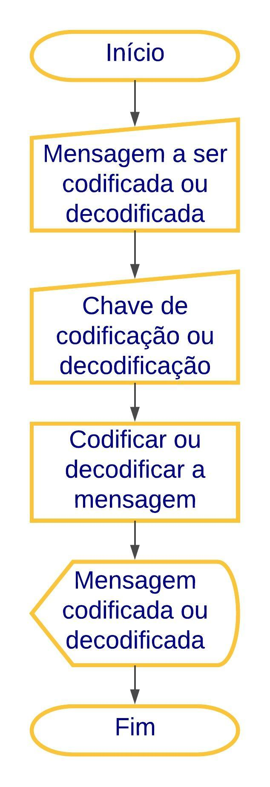

# Cifra de César

A Cifra de César, também conhecida como cifra de troca, código de César ou troca de César, é uma das mais simples e conhecidas técnicas de criptografia. É um tipo de cifra de substituição na qual cada letra do texto é substituída por outra, seguindo um número fixo para essa subtituição. Por exemplo, com uma troca de três posições, A seria substituído por D, B se tornaria E, e assim por diante. O nome do método é em homenagem a Júlio César, que o usou para se comunicar com os seus generais.

## Como funciona
O usuário digita a mensagem que deseja codificar ou descodificar, a chave de deslocamento e clica no botão. A aplicação criptografa ou descriptografa o texto inserido a partir da chave de deslocamento escolhida e devolve a mensagem final cifrada ou descifrada para o usuário. Em casos de caracteres especiais, o mesmo é retornado. Também são aceitos números negativos como deslocamento.

